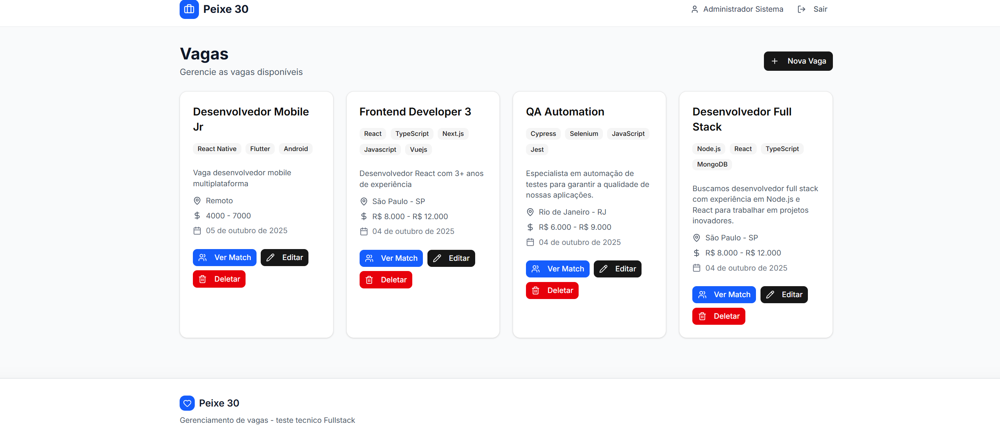
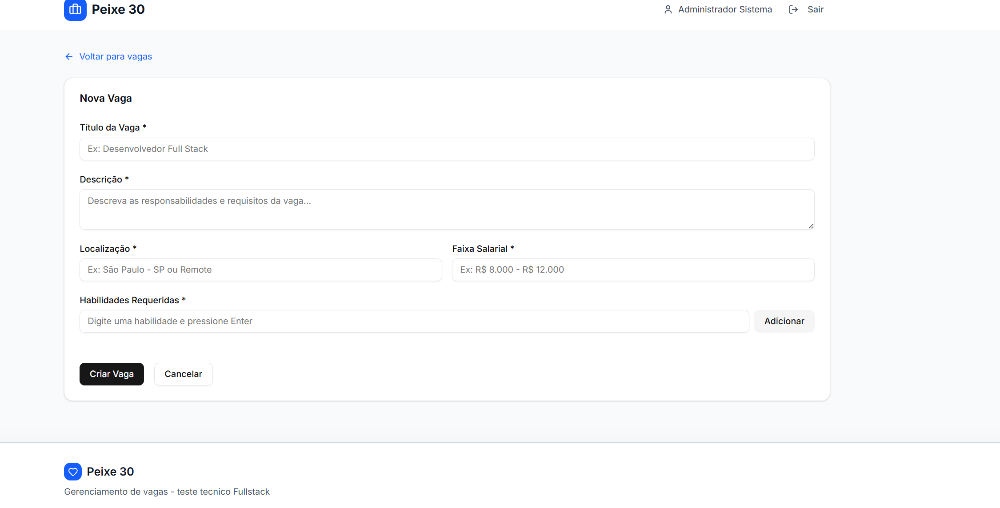
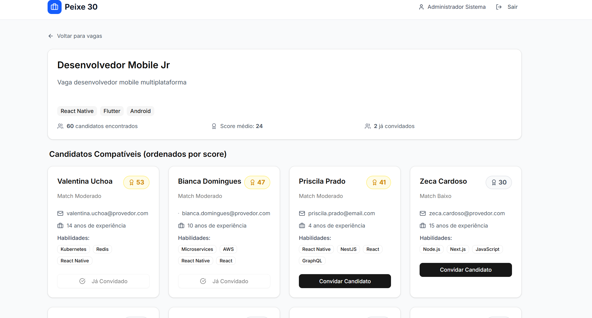
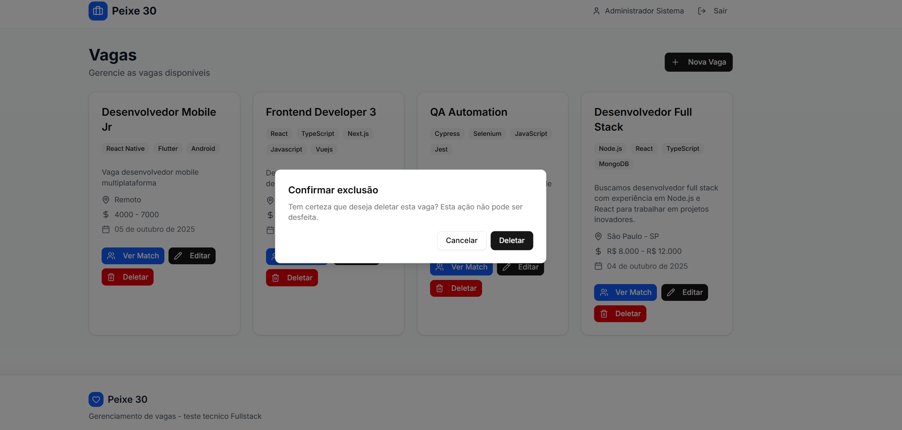

# 🎯 Peixe 30 - Sistema de Gestão de Vagas

Frontend da aplicação de gerenciamento de vagas e candidatos da Peixe 30, um sistema completo para matching inteligente entre vagas e candidatos.

## 🚀 Resumo Executivo

### 📋 **Como Executar Localmente**
```bash
# 1. Clone o repositório
git clone https://github.com/PhelipeG/frontend-peixe30-sistemas-vagas.git
cd frontend-peixe30-sistemas-vagas

# 2. Instale dependências
npm install

# 3. Configure variáveis de ambiente
cp .env.example .env.local
# Edite .env.local com: NEXT_PUBLIC_API_URL=http://localhost:3333/api

# 4. Execute a aplicação
npm run dev
# Acesse: http://localhost:3000
```

### 🔑 **Credenciais de Login**
- **Email**: `admin@peixe30.com`
- **Senha**: `admin123`

### 🌐 **URLs**
- **Local**: `http://localhost:3000`
- **Produção**: *Em desenvolvimento*

## 📋 Sobre o Projeto

O **Peixe 30** é um sistema web moderno para gestão de vagas de emprego que utiliza algoritmos de matching para conectar candidatos às oportunidades mais compatíveis. O sistema analisa skills, experiência e outros critérios para calcular um score de compatibilidade entre candidatos e vagas.

## 🛠️ Stack Tecnológico

### Frontend
- **Next.js 14** - Framework React com App Router
- **TypeScript** - Tipagem estática
- **Tailwind CSS** - Framework CSS utilitário
- **shadcn/ui** - Biblioteca de componentes modernos
- **React Hook Form** - Gerenciamento de formulários
- **Zod** - Validação de esquemas
- **Axios** - Cliente HTTP
- **date-fns** - Manipulação de datas
- **Lucide React** - Ícones SVG

### Ferramentas de Desenvolvimento
- **ESLint** - Linter para qualidade de código
- **PostCSS** - Processador CSS
- **TypeScript Compiler** - Verificação de tipos

## 📋 Pré-requisitos

Antes de começar, certifique-se de ter instalado em sua máquina:

- **Node.js** versão 18 ou superior ([Download aqui](https://nodejs.org/))
- **npm** ou **yarn** (geralmente vem com o Node.js)
- **Git** ([Download aqui](https://git-scm.com/))
- **Backend da aplicação** rodando (veja o README do backend)

## 📸 Screenshots do Sistema

### 🔐 Tela de Login

*Interface moderna e responsiva para autenticação de usuários*

### 📋 Listagem de Vagas

*Dashboard principal com todas as vagas cadastradas, paginação e ações rápidas*

### ➕ Criar Nova Vaga

*Formulário completo para cadastro de novas oportunidades com validação em tempo real*

### ✏️ Editar Vaga

*Interface de edição com dados pré-preenchidos e validação*

### 🎯 Matching de Candidatos

*Visualização de candidatos compatíveis com score de matching e sistema de convites*

### 🗑️ Confirmação de Exclusão

*Modal de confirmação para ações destrutivas*

## 🌐 URLs de Produção

### Frontend
- **URL de Produção**: Em desenvolvimento (não disponível ainda)
- **URL de Staging**: Em desenvolvimento (não disponível ainda)
- **Demonstração Local**: `http://localhost:3000`

### Backend (API)
- **URL da API**: Em desenvolvimento (não disponível ainda)
- **Documentação da API**: Em desenvolvimento (não disponível ainda)
- **API Local**: `http://localhost:3333/api`

### Acesso de Demonstração
Para testar localmente:
1. Clone e configure o backend
2. Clone e configure o frontend
3. Acesse `http://localhost:3000`
4. Use as credenciais: `admin@peixe30.com` / `admin123`

> 📝 **Nota**: As URLs de produção serão adicionadas após o deploy da aplicação.


## 📊 Sistema de Score de Compatibilidade

O frontend exibe o score calculado pelo backend com indicadores visuais intuitivos:

| Score | Cor | Badge | Descrição |
|-------|-----|-------|-----------|
| **80-100** | 🟢 Verde | "Excelente Match" | Candidato altamente compatível |
| **60-79** | 🔵 Azul | "Bom Match" | Candidato bem compatível |
| **40-59** | 🟡 Amarelo | "Match Moderado" | Candidato moderadamente compatível |
| **0-39** | ⚪ Cinza | "Match Baixo" | Candidato pouco compatível |

## 🔐 Credenciais de Acesso

### 🔑 Login Obrigatório
Para acessar o sistema, você **DEVE** usar as seguintes credenciais:

```
📧 Email: admin@peixe30.com
🔑 Senha: admin123
```

> ⚠️ **Importante**: Estas são as únicas credenciais válidas no sistema. Sem elas, não é possível acessar as funcionalidades da aplicação.

### 🚪 Como Fazer Login
1. Acesse `http://localhost:3000`
2. Na tela de login, digite:
   - **Email**: `admin@peixe30.com`
   - **Senha**: `admin123`
3. Clique em "Entrar"
4. Você será redirecionado para o dashboard principal

## 📁 Estrutura do Projeto

```
src/
├── app/                    # App Router (Next.js 14)
│   ├── (auth)/            # Grupo de rotas de autenticação
│   │   └── login/         # Página de login
│   ├── (dashboard)/       # Grupo de rotas do dashboard
│   │   ├── jobs/          # Páginas de vagas
│   │   └── layout.tsx     # Layout do dashboard
│   ├── globals.css        # Estilos globais
│   └── layout.tsx         # Layout raiz
├── components/            # Componentes reutilizáveis
│   ├── auth/             # Componentes de autenticação
│   ├── candidates/       # Componentes de candidatos
│   ├── jobs/             # Componentes de vagas
│   ├── shared/           # Componentes compartilhados
│   └── ui/               # Componentes base (shadcn/ui)
├── contexts/             # Contextos React
├── hooks/                # Hooks customizados
├── lib/                  # Utilitários e configurações
├── types/                # Definições de tipos TypeScript
└── validation-schemas/   # Esquemas de validação Zod
```

## � Deploy e Produção

### Variáveis de Ambiente para Produção
```env
NEXT_PUBLIC_API_URL=https://sua-api-producao.com/api
NODE_ENV=production
```

## ⏱️ Tempo de Desenvolvimento

### 📊 Breakdown do Desenvolvimento

| Fase | Descrição | Tempo Estimado |
|------|-----------|----------------|
| **Planejamento** | Análise de requisitos e arquitetura | 2h |
| **Setup Inicial** | Configuração do projeto Next.js | 2h |
| **UI/UX Design** | Implementação com shadcn/ui e Tailwind | 3h |
| **Autenticação** | Sistema de login e contexto | 2h |
| **CRUD de Vagas** | Páginas de listagem, criação e edição | 4h |
| **Sistema de Matching** | Página de candidatos e scores | 2h |
| **Responsividade** | Adaptação mobile-first | 2h |
| **Validações** | Formulários e tratamento de erros | 1h |
| **Documentação** | README e comentários | 1h |

### 🎯 **Total: ~19 horas**

## 📄 Licença

Este projeto foi desenvolvido como teste técnico para a **Peixe 30**.
---
<div align="center">

*Desenvolvido com ❤️ usando Next.js e TypeScript*

</div>